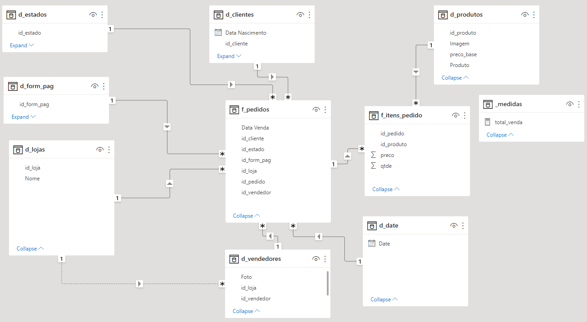
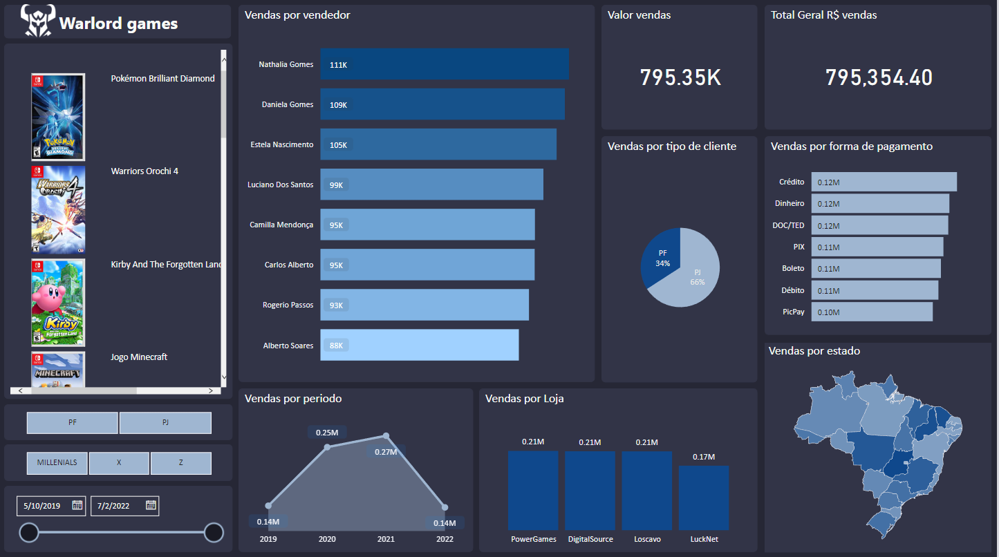

# kasolution_visao_geral_power_bi
## Source
- folder com arquivos de vendas
- dimensões em arquivo Base.xlsx
- csv com produtos
- txt com vendedores
- logo da empresa

## Modelagem dimensional
- criação das dimensões: estados, clientes, produtos, formas de pagamento, lojas, vendedores
- criação de tabela de datas
- criação de medida de total de vendas

## Report

